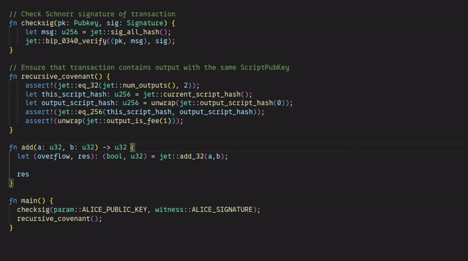
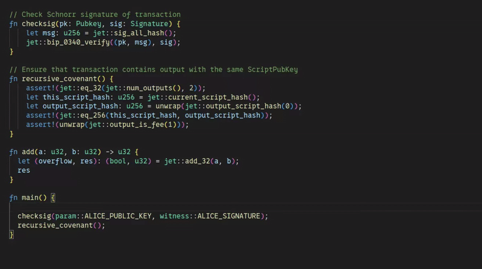
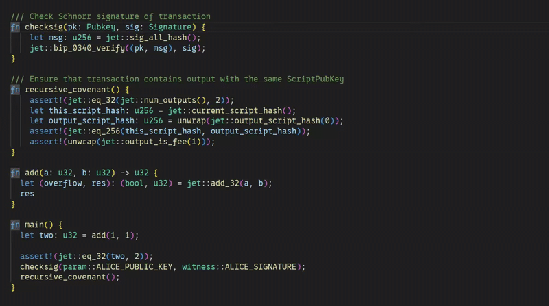
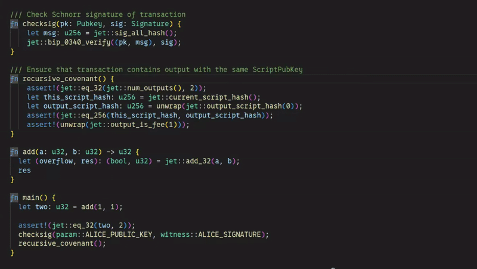

# SimplicityHL LSP

This project was originally part of [SimplicityHL](https://github.com/BlockstreamResearch/SimplicityHL), the high-level language for writing Simplicity smart contracts.

Language Server for [SimplicityHL language](https://simplicity-lang.org/).

## Features

- Basic diagnostic for SimplicityHL code



- Completions of built-ins, jets and functions, plus context-aware `use` paths and
  public importable items



- Hover for built-ins, jets and functions, with support of documentation



- Go to definition for functions



## Configuration

Editors send settings under the `simplicityhl` section. Every field is optional; the
defaults below are what the server uses when a client sends nothing.

```json
{
  "simplicityhl": {
    "experimentalFeatures": {
      "imports": false,
      "enums": false
    },
    "project": {
      "simplex": {
        "enabled": true,
        "manifestPath": ""
      },
      "sourceDirectory": "",
      "dependencies": {}
    }
  }
}
```

- `experimentalFeatures.imports` enables the compiler's unstable `use` / `mod` / `pub`
  syntax. It is off by default because the feature is unstable in the compiler itself.
- `experimentalFeatures.enums` enables enum declarations and enum match patterns,
  likewise unstable in the compiler.
- `project.simplex.enabled` looks for the nearest `Simplex.toml` (or `simplex.toml`)
  in the file's ancestors and honours its `build.src_dir` and `[dependencies]`, resolving
  path dependencies recursively and locating installed git dependencies under `deps/`.
- `project.simplex.manifestPath` pins an explicit manifest instead of searching. Relative
  values resolve from the containing workspace folder. A path that does not exist is
  reported as a diagnostic rather than silently ignored.
- `project.sourceDirectory` overrides the package root when there is no manifest, or when
  the manifest's `src_dir` is not what the editor should use.
- `project.dependencies` adds import roots by hand. They supplement the manifest and win
  on a colliding alias:

```json
{
  "std": "../simplicityhl-std/simf",
  "math": { "path": "../math/simf", "context": "simf/contracts" }
}
```

  The shorthand form maps an alias for the whole package. The detailed form restricts the
  mapping to files under `context`, matching how the compiler scopes dependencies per
  package.

Configuration changes take effect immediately: the server re-analyses open documents on
`workspace/didChangeConfiguration`, on workspace-folder changes, and when a watched
`.simf` file or Simplex manifest changes on disk.

## Installation

Install Language Server using `cargo`:

```bash
cargo install simplicityhl-lsp
```

## Integration with editors

### Neovim

#### LSP

0. Install `simplicityhl-lsp` to your `PATH`.

1. Include this Lua snippet to your Neovim config:

```lua
vim.filetype.add({
	extension = {
		simf = "simf",
	},
})

vim.lsp.config["simplicityhl-lsp"] = {
	cmd = { "simplicityhl-lsp" },
	filetypes = { "simf" },
	settings = {
		simplicityhl = {
			experimentalFeatures = { imports = true, enums = false },
			project = { simplex = { enabled = true, manifestPath = "" } },
		},
	},
}
vim.lsp.enable("simplicityhl-lsp")
```

2. Open `.simf` file and check that LSP is active ("attached"):

```vim
:checkhealth vim.lsp
```

#### Tree-sitter (Highlighting)

Currently, the Language Server does not provide any syntax highlighting on its own, but you can install tree-sitter for SimplicityHL:

0. Set up the [`nvim-treesitter`](https://github.com/nvim-treesitter/nvim-treesitter/tree/main) plugin.

1. Include this Lua snippet in your Neovim config to register parser:

```lua
vim.api.nvim_create_autocmd("User", {
	pattern = "TSUpdate",
	callback = function()
		require("nvim-treesitter.parsers").simplicityhl = {
			install_info = {
				url = "https://github.com/distributed-lab/tree-sitter-simplicityhl",
				queries = "queries",
			},
			filetype = "simf",
			tier = 0,
		}
	end,
})

vim.treesitter.language.register("simplicityhl", { "simf" })

vim.api.nvim_create_autocmd("FileType", {
	pattern = { "simf" },
	callback = function()
		vim.treesitter.start()
	end,
})
```

2. Restart Neovim and run:

```vim
:TSInstall simplicityhl
```

If everything is working correctly, you should see syntax highlighting in `.simf` files.

**Note:** This method is compatible only with `nvim-treesitter` v0.10 or newer.

